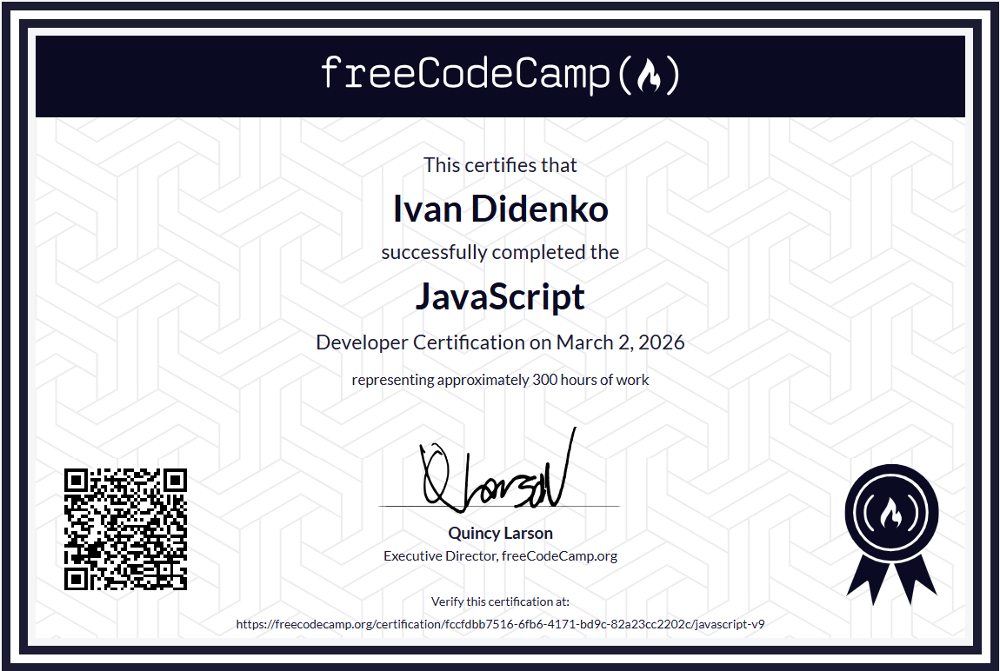

# 🚀 freeCodeCamp JavaScript Algorithms and Data Structures

Цей репозиторій — це мій повний шлях навчання на курсі **freeCodeCamp**. Тут зібрані всі модулі: від базових основ до складних асинхронних додатків та фінальних сертифікаційних проектів.

---

## 🛠 Технологічний стек
* **Мова:** JavaScript (ES6+)
* **Інструменти:** HTML5, CSS3, Markdown
* **API:** Fetch API, REST Services
* **Зберігання:** LocalStorage, Web Storage API

---

## 📂 Навігація по навчальному курсу

*Натисніть на назву модуля, щоб перейти до відповідної папки з кодом.*

### Основи (Modules 01 - 07)
* 🔢 [**01-Variables-and-Strings**](./01-Variables-and-Strings) — Основи синтаксису.
* ⚖️ [**02-Booleans-and-Numbers**](./02-Booleans-and-Numbers) — Логіка та числа.
* ⚙️ [**03-Functions**](./03-Functions) — Робота з функціями.
* 📑 [**04-Arrays**](./04-Arrays) — Маніпуляції з масивами.
* 📦 [**05-Objects**](./05-Objects) — Об'єкти та структури даних.
* 🔄 [**06-Loops**](./06-Loops) — Алгоритми та цикли.
* 🏛️ [**07-JavaScript-Fundamentals-Review**](./07-JavaScript-Fundamentals-Review) — Огляд фундаментальних знань.

### ⚡ Просунутий JavaScript (Modules 08 - 14)
* 🧪 [**08-Higher-Order-Functions**](./08-Higher-Order-Functions) — Функції вищого порядку.
* 🖱️ [**09-DOM-Manipulation-and-Events**](./09-DOM-Manipulation-and-Events) — Робота з інтерфейсом.
* ♿ [**10-JavaScript-and-Accessibility**](./10-JavaScript-and-Accessibility) — Доступність (A11y).
* 🐞 [**11-Debugging**](./11-Debugging) — Пошук помилок у коді.
* 🔡 [**12-Basic-Regex**](./12-Basic-Regex) — Регулярні вирази.
* 📋 [**13-Form-Validation**](./13-Form-Validation) — Валідація форм.
* 📅 [**14-Dates**](./14-Dates) — Обробка дат та часу.

### 🧩 Глибоке занурення (Modules 15 - 21)
* 🎥 [**15-Audio-and-Video-Events**](./15-Audio-and-Video-Events) — Медіа-події.
* 🗺️ [**16-Maps-and-Sets**](./16-Maps-and-Sets) — Колекції Map та Set.
* 💾 [**17-localStorage-and-CRUD**](./17-localStorage-and-CRUD) — Локальне сховище.
* 🏗️ [**18-Classes**](./18-Classes) — Об'єктно-орієнтоване програмування.
* 🌀 [**19-Recursion**](./19-Recursion) — Рекурсивні алгоритми.
* 🧬 [**20-Functional-Programming**](./20-Functional-Programming) — Функціональний підхід.
* 🌐 [**21-Asynchronous-JavaScript**](./21-Asynchronous-JavaScript) — Асинхронність та API.

---

## 🏆 Фінальні сертифікаційні проекти

*Ці проекти об'єднують усі навички, отримані під час курсу:*

1.  📝 [**Markdown-to-HTML-Converter**](./Markdown-to-HTML-Converter)
2.  🥁 [**Drum-Machine**](./Drum-Machine)
3.  🗳️ [**Voting-System**](./Voting-System)
4.  🏦 [**Bank-Account-Management**](./Bank-Account-Management)
5.  ☁️ [**Weather-App**](./Weather-App)

---

## 🏆 Certifications

Після успішного завершення всіх модулів та фінальних проектів, я здобув офіційну сертифікацію від **freeCodeCamp**. Це підтверджує мої знання в алгоритмах, структурах даних та сучасному JavaScript (ES6+).

### JavaScript Algorithms and Data Structures (Beta)

  
   
  <a href="https://www.freecodecamp.org/certification/fccfdbb7516-6fb6-4171-bd9c-82a23cc2202c/javascript-v9">🔗 Переглянути верифіковану версію на freeCodeCamp.org</a>

---
*Created by [Ivan Didenko] — 2026*
